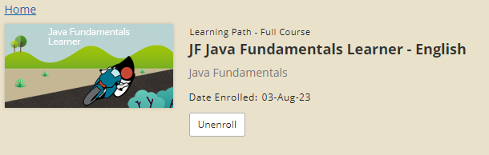

<h1>Inventory Project</h1>
<h2>Overview</h2>

This is an inventory program that can be used for a range of different products.
The <em>language</em> used for the program is <strong>Object-Oriented Programming</strong>, therefore
there are 2 classes:

<ul> 
<li><em>the driver class</em>: <strong>ProductTester</strong>, which is in charge of running the object class</li> 
<li><em>the object class</em>: <strong>Product</strong></li>
</ul>
<h2>Features</h2>
<ul>
<li>Adding products to the inventory</li>
<li>Viewing products that are stored</li>
</ul>
<h2>OOP concepts used</h2>
<ul>
<li><strong>Encapsulation</strong>: in the Product class the instance fields are declared as private.</li>
<li><strong>Polymorphism</strong>: through the use of overriding instance methods</li>
</ul>
<h2>Inspiration</h2>

This personal project was inspired by the <strong>JF Java Fundamentals Learner course on ORACLE Academy</strong>. It was made for learning purposes.

